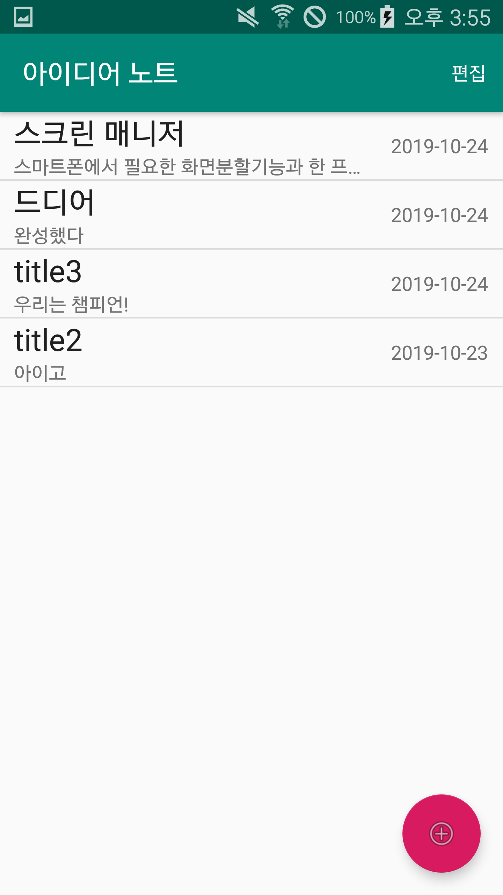
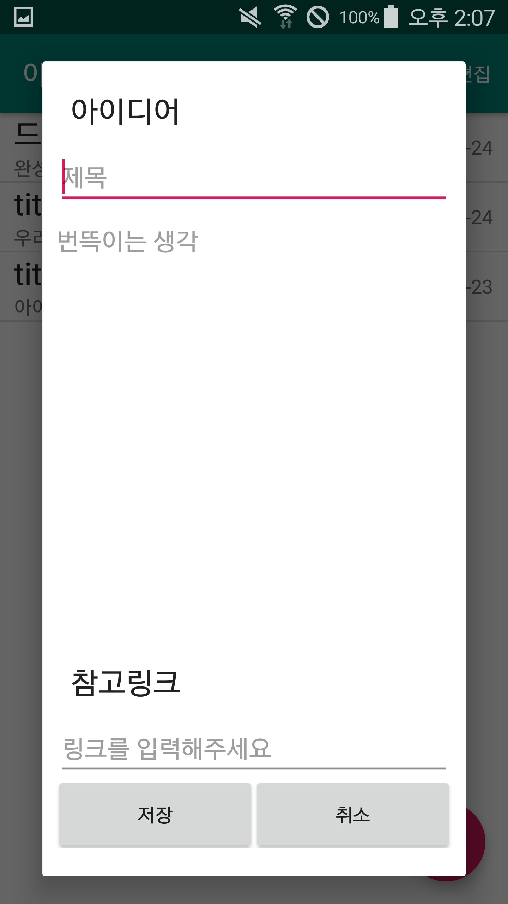

App_아이디어 노트_Solo
=====================
컴퓨터 구성 / 필수 조건 안내 (Prerequisites)
------------
minsdkVersion 15, targetsdkVersion 29

설치 안내 (Installation Process)
-------------
APK파일을 이용한 설치 또는 클론 다운 이후 안드로이드 스튜디오를 이용하여 실행

사용법 (Getting Started)
-------------
</img> 
앱 실행시 뜨는 화면  

</img> 
우하단에 있는 빨간 버튼을 누를시 뜨는 아이디어 추가 다이어그램  

</img> 
삭제하고자 하는 아이디어를 꾹 누르면 뜨는 화면  

</img> 
우상단 편집버튼을 누를시 뜨는 화면

</img> 
편집하고자하는 아이디어의 편집버튼을 누를시 뜨는 화면  

파일 정보 및 목록 (File Manifest)
-------------
MainActivity로만 이루어져있는 간단한 앱

저작권 및 사용권 정보 (Copyright / End User License)
-------------
Copyright@ 2019 Nomalman

배포자 및 개발자의 연락처 정보 (Contact Information)
-------------
김승겸  
Tel: 010-2683-7449  
email: fxf24@naver.com

알려진 버그 (Known Issues)
-------------
편집을 눌러서 편집취소가 떳을 때 앱을 나갔다 들어오면 편집으로 바뀌는 버그

문제 발생에 대한 해결책 (Troubleshooting)
-------------
onResume()에 앱에 데이터를 뿌려주게 되어있는데 아마 savedInstanceState를 이용하면 어떻게 할 수 있지 않을까...

크레딧 (Credit)
-------------
>개발자 김승겸  
>작성자 김승겸

업데이트 정보 (Change Log)
-------------
버전 0.01
